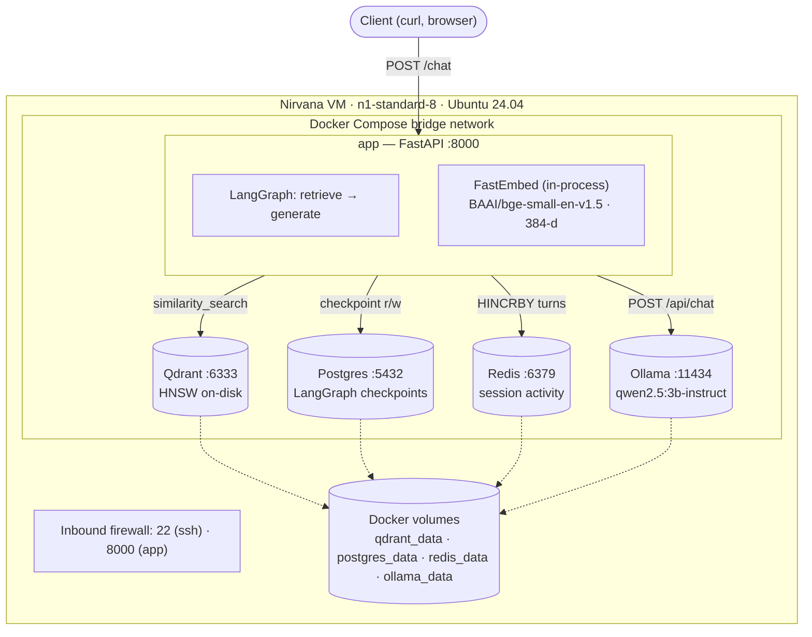
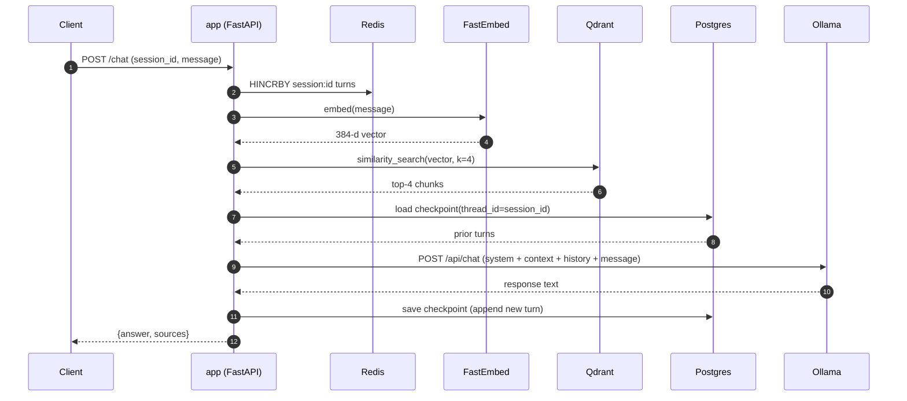

<div align="center">
  <a href="https://nirvanalabs.io">
    
  </a>

  [Sign Up](https://nirvanalabs.io/sign-up) · [Docs](https://docs.nirvanalabs.io) · [API](https://docs.nirvanalabs.io/api) · [Examples](https://github.com/nirvana-labs-examples) · [Terraform](https://registry.terraform.io/providers/nirvana-labs/nirvana/latest) · [TypeScript SDK](https://www.npmjs.com/package/@nirvana-labs/nirvana) · [Go SDK](https://github.com/Nirvana-Labs/nirvana-go) · [CLI](https://github.com/nirvana-labs/nirvana-cli) · [MCP](https://www.npmjs.com/package/@nirvana-labs/nirvana-mcp)
</div>

---

# LangChain RAG Agent on Nirvana Labs

Terraform & Ansible example for deploying a single-VM LangChain + LangGraph RAG agent on Nirvana ABS storage. The whole stack is self-hosted — no third-party API keys are required for inference.

The agent answers questions over a small set of seed documents that are auto-ingested on first start. Bring your own documents via the `/ingest` endpoint.

## Architecture



### Request flow for `POST /chat`



## How It Works

1. **Terraform** provisions a VPC, firewall rules (22, 8000), and one Nirvana VM with ABS boot volume.
2. **Ansible** installs Docker, copies the app source, and brings up the Docker Compose stack.
3. **First run** pulls the Ollama model (~2 GB) and auto-ingests `app/docs/*.md` into Qdrant so the chat endpoint works immediately.
4. **`/chat`** invokes a LangGraph state machine (`retrieve → generate`). Retrieval uses FastEmbed locally and Qdrant for the vector search; generation uses the local Ollama model. Conversation state for each `session_id` lives in Postgres so follow-ups remember context.

## Prerequisites

- [Terraform](https://www.terraform.io/downloads.html) >= 1.5
- [Ansible](https://docs.ansible.com/ansible/latest/installation_guide/intro_installation.html) >= 2.15 with `community.docker` and `ansible.posix` collections
  ```bash
  ansible-galaxy collection install community.docker ansible.posix
  ```
- [Nirvana Labs API Key](https://dashboard.nirvanalabs.io/settings/api-keys)
- SSH key pair

## Quick Start

### 1. Configure Terraform

```bash
cd terraform

cat > terraform.tfvars << EOF
ssh_public_key     = "ssh-ed25519 AAAA... user@host"
nirvana_project_id = "your-project-id"
EOF

export NIRVANA_LABS_API_KEY="your-api-key"
```

### 2. Deploy Infrastructure

```bash
terraform init
terraform apply
```

### 3. Generate Ansible Inventory

```bash
cd ..
chmod +x scripts/generate-inventory.sh
./scripts/generate-inventory.sh
```

### 4. Run Ansible Playbook

```bash
cd ansible

# Optional: pick a different Ollama model
# export OLLAMA_MODEL="llama3.2:3b-instruct"

ansible-playbook playbook.yml
```

The first run pulls a ~2 GB Ollama model and takes a few extra minutes. Subsequent runs are fast — the model is cached in a Docker volume.

### 5. Talk to the Agent

```bash
# Ask a question grounded in the seed docs
curl http://<PUBLIC_IP>:8000/chat \
  -H "Content-Type: application/json" \
  -d '{"session_id":"demo","message":"What is this app and what does it use Postgres for?"}'

# Follow-up in the same session — Postgres checkpoint preserves history
curl http://<PUBLIC_IP>:8000/chat \
  -H "Content-Type: application/json" \
  -d '{"session_id":"demo","message":"Which embedding model does it use?"}'

# Add your own docs
curl http://<PUBLIC_IP>:8000/ingest \
  -H "Content-Type: application/json" \
  -d '{"source":"notes","texts":["Your knowledge base content here."]}'

# Index size and health
curl http://<PUBLIC_IP>:8000/docs/count
curl http://<PUBLIC_IP>:8000/health
```

## Configuration

### Terraform Variables

| Variable | Default | Description |
|----------|---------|-------------|
| `ssh_public_key` | — (required) | SSH public key for VM access |
| `nirvana_project_id` | — (required) | Nirvana project ID |
| `nirvana_region` | `us-sva-2` | Nirvana region |
| `nirvana_instance_type` | `n1-standard-8` | VM size. `n1-standard-4` works but Ollama CPU inference is noticeably slower |
| `nirvana_storage_size` | `64` | Boot volume size in GB |
| `nirvana_storage_type` | `abs` | Advanced Block Storage |
| `vm_name` | `langchain-app` | Name of the deployed VM |

### Environment Variables

| Variable | Default | Description |
|----------|---------|-------------|
| `NIRVANA_LABS_API_KEY` | — (required) | Used by Terraform to provision the VM |
| `OLLAMA_MODEL` | `qwen2.5:3b-instruct` | Ollama model to pull and serve. Anything Ollama supports |

## What Gets Deployed

| Resource | Description |
|----------|-------------|
| VPC | Private network for the application |
| Firewall rules | SSH (22) and app HTTP (8000) |
| VM | Ubuntu 24.04 with the Docker Compose stack |
| `app` container | FastAPI + LangGraph + FastEmbed |
| `qdrant` container | Vector store (HNSW index, on-disk) |
| `postgres` container | LangGraph checkpoint store |
| `redis` container | Per-session activity counters |
| `ollama` container | Local LLM server (CPU inference) |

## Ports

| Port | Protocol | Service | Exposed publicly? |
|------|----------|---------|--------------------|
| 22 | TCP | SSH | Yes |
| 8000 | TCP | FastAPI (`/chat`, `/ingest`, `/health`, `/docs/count`) | Yes |
| 6333 | TCP | Qdrant HTTP | No (internal) |
| 6334 | TCP | Qdrant gRPC | No (internal) |
| 5432 | TCP | Postgres | No (internal) |
| 6379 | TCP | Redis | No (internal) |
| 11434 | TCP | Ollama | No (internal) |

## HTTP API

### `POST /chat`

Send a message in a session and get a grounded answer.

```bash
curl http://<IP>:8000/chat \
  -H "Content-Type: application/json" \
  -d '{"session_id":"demo","message":"What is HNSW?"}'
```

Returns:

```json
{
  "session_id": "demo",
  "answer": "...",
  "sources": ["02-architecture.md", "05-faq.md"]
}
```

### `POST /ingest`

Add new documents to the knowledge base.

```bash
curl http://<IP>:8000/ingest \
  -H "Content-Type: application/json" \
  -d '{
        "source": "release-notes",
        "texts": [
          "Qdrant 1.16 introduces inline storage for HNSW indexes.",
          "Tiered multi-tenancy routes hot tenants to dedicated shards."
        ]
      }'
```

Each text is chunked (≈800 chars, 120 overlap), embedded, and stored in Qdrant. `source` is preserved on every chunk and surfaced in `/chat` responses.

### `GET /docs/count`

Returns the number of indexed chunks: `{"chunks": 42}`.

### `GET /health`

Liveness check with current index size and model in use:

```json
{"ok": true, "qdrant_chunks": 16, "model": "qwen2.5:3b-instruct"}
```

## Customizing

### Change the LLM

The default model is `qwen2.5:3b-instruct` (~2 GB, fast on CPU). Anything Ollama supports works — pull a larger model for better answers:

```bash
OLLAMA_MODEL="llama3.1:8b-instruct" ansible-playbook playbook.yml
```

For models above ~3 B parameters, bump the VM to `n1-standard-16` for usable CPU inference latency.

### Use Your Own Documents

The first deployment auto-ingests the markdown files in `app/docs/` into Qdrant. To rebuild the index with your own docs:

1. Replace files in `app/docs/` with your own markdown.
2. Re-run the playbook (`ansible-playbook playbook.yml`).
3. Wipe the Qdrant volume to force re-ingest: `ssh ubuntu@<IP> 'cd /opt/langchain-app && docker compose down -v && docker compose up -d'`.

Alternatively, ingest at runtime via the `/ingest` endpoint without redeploying.

### Tune the Agent

Edit `app/main.py` to change retrieval parameters (`k=4`), chunk size (`chunk_size=800`), or extend the LangGraph state machine with additional nodes (e.g., query rewriting, re-ranking, tool use).

## Cleanup

```bash
cd terraform
terraform destroy
```

## Security Notes

- `/chat` and `/ingest` have no authentication — add an API key, JWT, or VPC-only firewall before public exposure.
- Postgres uses default credentials (`app/app`) — change them in `ansible/roles/deploy/templates/env.j2` and `docker-compose.yml.j2` for any non-demo deployment.
- The app is HTTP-only; put a reverse proxy (Caddy/Nginx) with TLS in front for production.
- Consider restricting the inbound firewall on port 8000 to specific source IPs in `terraform/main.tf`.

## Resources

- [LangChain Documentation](https://python.langchain.com/docs/introduction/)
- [LangGraph Documentation](https://langchain-ai.github.io/langgraph/)
- [Qdrant Documentation](https://qdrant.tech/documentation/)
- [Ollama Documentation](https://github.com/ollama/ollama/tree/main/docs)
- [Nirvana Labs Documentation](https://docs.nirvanalabs.io)
- [Nirvana Terraform Provider](https://registry.terraform.io/providers/nirvana-labs/nirvana/latest)

## License

Apache 2.0 — see [LICENSE](LICENSE.md).
